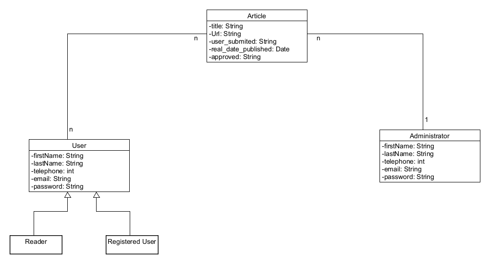
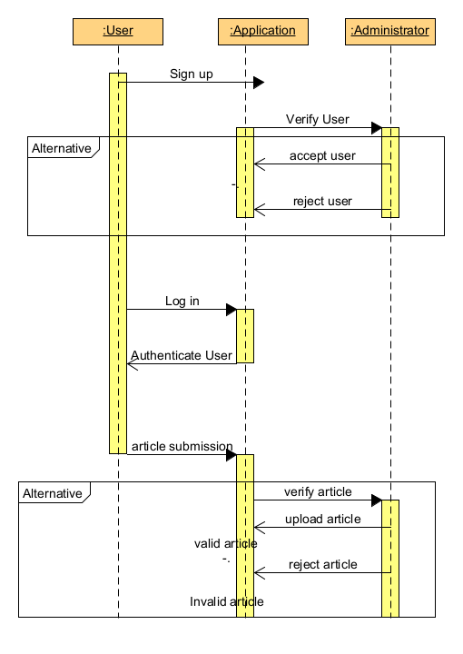
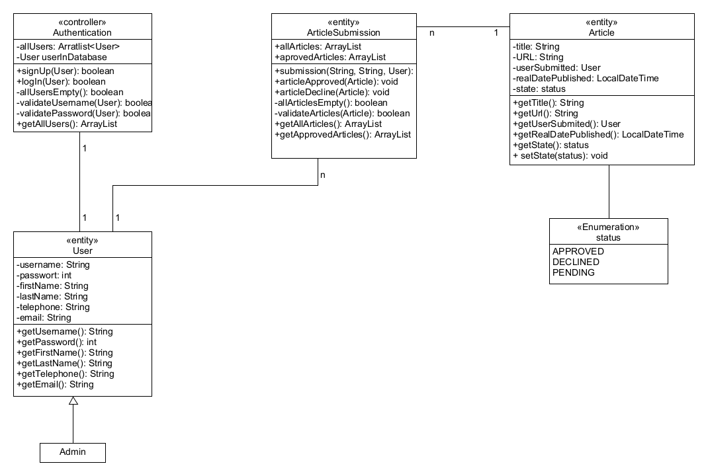
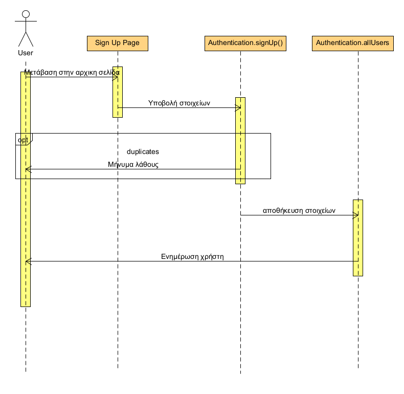
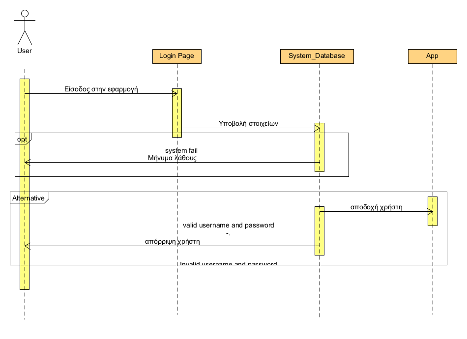
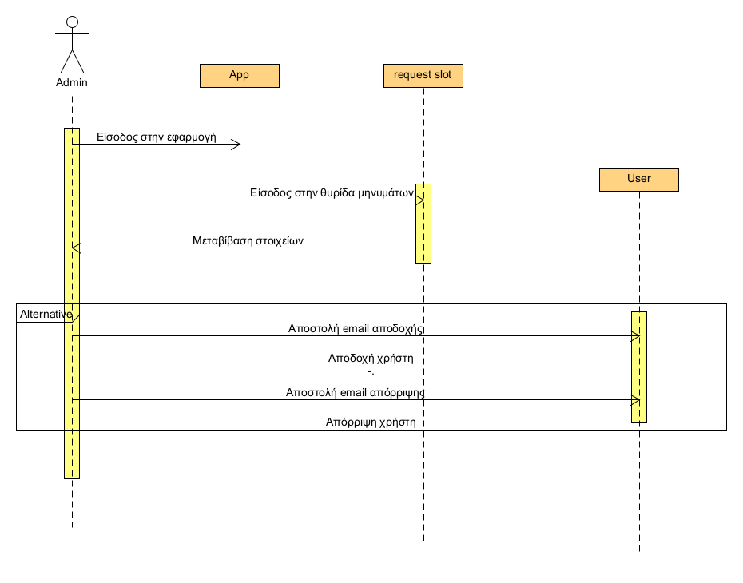
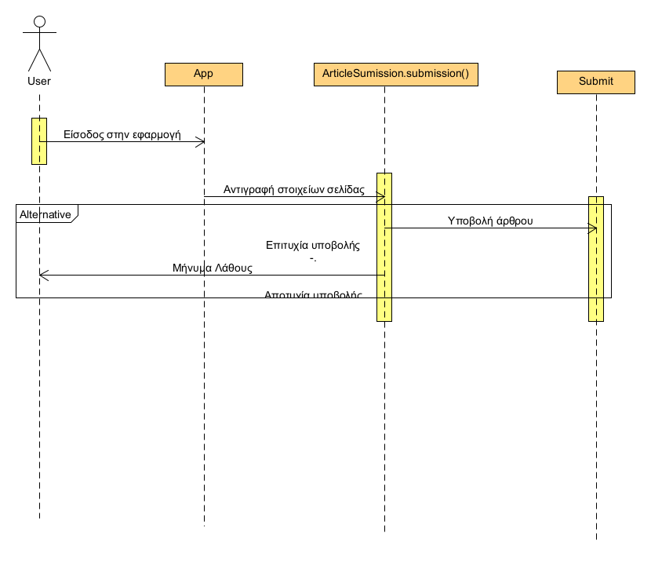

# **Εφαρμογή Ειδήσεων (Valid News Live)**

# Εισαγωγή

Η εφαρμογή αυτή αφορά την αναμετάδοση ειδήσεων σε μία κεντρική ροή άρθρων από διάφορες πηγές. Βασική λειτουργία της εφαρμογής είναι η συλλογή άρθρων από εγκεκριμένες πηγές (κρατικά site, κρατικές υπηρεσίες κ.α.) ή από προτάσεις χρηστών και σκοπό έχει την κατά το δυνατό έγκυρη ενημέρωση των χρηστών της για διάφορα θέματα.

## Εμβέλεια

Το πρόβλημα που προκύπτει από την περιήγηση ενός client στο διαδίκτυο για την ενημέρωσή του, είναι η παραπληροφόρηση (fake news) από μη έγκυρες πηγές. Το εν λόγω λογισμικό θα παρέχει λειτουργία για τα εξής:
- Αίτηση για δημιουργία λογαριασμού (sign up): οι χρήστες θα μπορούν να υποβάλλουν αίτηση για δημιουργία ενός λογαριασμού που θα τους δίνει και τον ρόλο τους (χρήστης με δυνατότητα υποβολής άρθρων).
- Έγκριση/απόρριψη δημιουργίας λογαριασμού: ο admin θα έχει μια εικόνα με όλες τις αιτήσεις δημιουργίας νέων λογαριασμών (sign up) και θα μπορέι να εγκρίνει ή να απορρίπτει κάθε μία από αυτές.
- Εισοδο ως client ή admin (sign in): βάση του λογαριασμού που έχουν δημιουργήσει, οι χρήστες συνδέονται στον λογαριασμό τους.
- Περιήγηση σε μία κεντρική ροή άρθρων (από επιλεγμένες πηγές): θα υπάρχει η κύρια σελίδα με την κεντρική ροή ειδήσεων στην οποία θα μπορούν να περιηγούνται και οι εγγεγραμένοι χρήστες και οι επισκέπτες (απλοί χρήστες).
- Ανάγνωση άρθρων: Από την κεντρική ροή άρθρων, ο χρήστης θα μπορεί να επιλέγει το άρθρο που τον ενδιαφέρει.
- Υποβολή άρθρων-πηγών: την δυνατότητα αυτή θα την έχει ένας χρήστης ο οποίος έχει δημιουργήσει λογαριασμό. Θα μπορεί να υποβάλει σε συγκεκριμενο πεδίο το άρθρο που θεωρεί ότι πρέπει να εμφανιστεί στην κεντρική ροή άρθρων.
- Έγκριση/απόρριψη αρθρων-πηγών: ο διαχειριστής του συστήματος ελέγχει τις πηγές που έχουν προτείνει οι χρήστες, και εφόσον ελέγξει την εγκυρότητα τους, τις προσθέτει στην κεντρική ροή άρθρων.

Το λογισμικό δεν θα παρέχει δυνατότητα για:
- Δημιουργία νέων άρθρων: δεν θα υπάρχει κάποιο πεδίο ώστε οι χρήστες να γράφουν τα δικά τους άρθρα. Τα άρθρα θα έχουν παρθεί από άλλες ιστοσελίδες.
- Διαμοιρασμό άρθρων με κάποια αυτοματοποίηση: δεν θα υπάρχει η δυνατότητα διαμοιρασμού (share) είτε μεταξυ εγγεγραμένων χρηστών είτε σε μη εγγεγραμένους χρήστες.
- Τροποποίηση άρθρων: τα άρθρα θα ανεβαίνουν στην κεντρική ροή άρθρων αυτούσια. Δεν θα μπορούν ούτε οι χρήστες ούτε ο διαχειριστής να τα επεξεργαστούν.
- Παρακολούθηση εξέλιξης της διαδικασίας έγκρισης: όταν ο χρήστης υποβάλει κάποια πρόταση δεν θα μπορεί να παρακολουθεί αν έχει διαβαστεί από τον διαχειριστή.

## Ορισμοί ακρώνυμα και συντομογραφίες

- Client: Ο τελικός χρήστης του λογισμικού. Αυτός που θα επωφελείται από την χρήση της εφαρμογής.
- Admin: Ο διαχειριστής του συστήματος. Αυτός που θα ελέγχει έμμεσα τη ροή ειδήεων με έγκριση ή απόρριψη άρθρων.
- Άρθρο:  Ένα γραπτό κείμενο, συνήθως ορισμένης έκτασης, που αναφέρεται σε ένα συγκεκριμένο επίκαιρο ή ειδικό θέμα και έχει ειδησεογραφικό χαρακτήρα.
- Ροή άρθρων: Μία οργανωμένη συστοιχία από άρθρα που παρουσιάζονται σε φιλίκή προς τον χρήστη μορφή.
- Δημιουργία Λογαριασμού: Η διαδικασία κατά την οποία ένας χρήστης (client ή admin) εισέρχεται για πρώτη φορά στο σύστημα δημιουργώντας προσωποποιημένο λογαριασμό.

# Συνολική περιγραφή

## Επισκόπηση μοντέλου περιπτώσεων χρήσης

# Ειδικές Απαιτήσεις 

## Περιπτώσεις χρήσης

### Περιγραφές περιπτώσεων χρήσης

#### [ΠΧ1 Εγγραφή Απλού Χρήστη](uc1-simple-user-sign-up.md)

#### [ΠΧ2 Σύνδεση Χρήστη](uc2-user-log-in.md)

#### [ΠΧ3 Έγκριση Εγγραφής Χρήστη](uc3-account-confirmation.md)

#### [ΠΧ4 Ανάγνωση Άρθρων](uc4-read-articles.md)

#### [ΠΧ5 Υποβολή Άρθρων - Πηγών](uc5-submit-articles.md)

#### [ΠΧ6 Έλεγχος/Έγκριση Άρθρων](uc6-article-confirmation.md)

## Συμπληρωματικές προδιαγραφές

### Απαιτήσεις διεπαφών

* **Ανταπόκριση του server:** αρχικά θα πρέπει να γίνει επιλογή κατάλληλου hardware ώστε να υπάρξει γρήγορη ανταπόκριση στα αιτήματα του χρήστη. Ο server θα είναι υπεύθυνος και για αποστολή ενημερωτικών email στους χρήστες.
* **Εύχρηστο και κατανοητό UΙ:** το UI αποτελεί ένα σημαντικό κομμάτι μιας εφαρμογής που μπορεί να κρίνει την επιτυχεία της. Στόχος μας είναι να προσφέρουμε στον χρήστη την καλύτερη δυνατή εμπειρεία όταν χρησιμοποιεί την εφαρμογή. Επομένως θα εστιάσουμε σε κλασσικά πρότυπα με τα οποία οι περισσότεροι χρήστες θα είναι γνώριμοι. Θα διεξάγουμε την κατάλληλη και απαραίτητη έρευνα για να παρουσιάσουμε στους χρήστες ένα απλό και ταυτόχρονα ευχάριστο UI.  

### Περιορισμοί σχεδίασης και υλοποίησης

* Το σύστημα θα αναπτυχθεί σε Android Studio IDE.
* Το σύστημα θα αναπτυχθεί σε Java 8.
* Το σύστημα δε θα διαθέτει βάση δεδομένων.

### Ποιοτικά χαρακτηριστικά

#### Απόδοση

* Το σύστημα θα πρέπει να επιτρέπει έως και 100 εγγεγραμένους χρήστες και επιλέον τον admin.
* Η εναλαγή ανάμεσα στις διάφορες καρτέλες θα πρέπει να είναι σύντομη. 

#### Διαθεσιμότητα

* Το σύστημα θα πρέπει να είναι πάντα διαθέσιμο.

#### Ασφάλεια

* Ο χρήστης και ο admin, για να εισέλθουν στο σύστημα θα πρέπει πρώτα να αυθεντικοποιούνται.
* Οι λειτουργίες απλής άναγνωσης θα είναι ελεύθερες για κάθε απλό χρήστη.
* Δε θα μπορεί να δημιουργηθεί χρήστης με διπλότυπα στοιχεία, δηλαδή στοιχεία που υπάρχουν ήδη.

#### Ευελιξία

* Ο admin θα πρέπει να ενημερώνεται από το σύστημα εντός της εφαρμογής για νέα αιτήματα δημιουργίας λογαριασμού με άμεσο τρόπο.

#### Ευχρηστία

* Ο χρήστης θα πρέπει να είναι σε θέση να γνωρίζει την χρήση μια απλής εφαρμογής για κινητές συσκευές.
* Ο χρήστης θα έχει τη δυνατότητα να χειρίζεται την εφαρμογή μέσω έυχρηστου UI με κατανοητά μηνύματα.

# Υποστηρικτικό υλικό

## Μοντέλο πεδίου

## Ανάλυση περιπτώσεων χρήσης
--------------------------

### Διάγραμμα Ακολουθίας

### Κλάσεις ανάλυσης

### Συμπεριφορές

#### Εγγραφή Χρήστη

#### Σύνδεση Χρήστη

#### Αποδοχή- Απόρριψη Χρήστη

#### Αποδοχή Άρθρου

