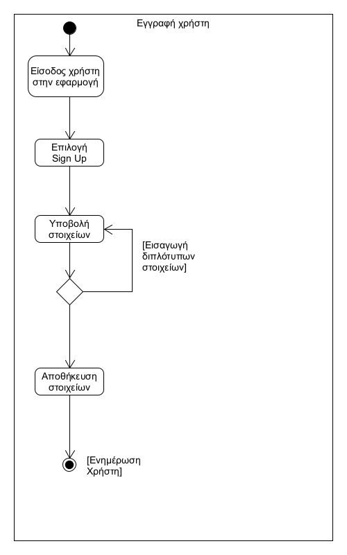

# ΠΧ1. Εγγραφή Απλού Χρήστη (Sign Up)

**Πρωτεύων Actor**: Απλός Χρήστης  
**Ενδιαφερόμενοι**  
**Απλός Χρήστης**: Να συμπληρώνει ορθά τα πεδία εγγραφής.  
**Admin**: Ο admin αφού ελέγξει την ύπαρξη αιτήματος δημιουργίας νέου χρήστη (sign up), θα την εγκρίνει ή θα την απορρίπτει.  
**Προϋποθέσεις**: Ο χρήστης admin έχει ήδη δημιουργηθεί ή υφίσταται η ύπαρξή του με την εναρξη της εφαρμογής.  

## Βασική Ροή

1.	Ο χρήστης εισέρχεται στην εφαρμογή.
2.	Ο χρήστης επιλέγει την δημιουργία λογαριασμού.
3.	Ο χρήστης υποβάλει τα στοιχεία του στην φόρμα εγγραφής.
4.	Το σύστημα αποθηκεύει τα  στοιχεία του χρήστη.
5.	Ο χρήστης ενημερώνεται ότι η αίτησή του έχει καταχωρηθεί.

## Εναλλακτικές Ροές

1α. Ο χρήστης δεν μπορεί να εισέλθει στην εφαρμογή.  
  1.	Ο χρήστης συνδέεται εκ νέου στην εφαρμογή.

3α. Ο χρήστης υποβάλει στοιχεία που υπάρχουν ήδη.  
  1.	Το σύστημα ενημερώνει τον χρήστη ότι τα στοιχεία του δεν έχουν καταχωρηθεί λόγω προυπάρχοντος λογαριασμού.

