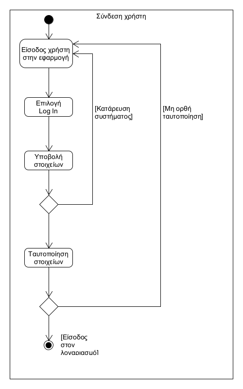

# ΠΧ2. Σύνδεση Χρήστη (Log In)

**Πρωτεύων Actor**: Χρήστης  
**Ενδιαφερόμενοι**  
**Χρήστης**: Να συμπληρώνει ορθά τα στοιχεία σύνδεσης.  
**Προϋποθέσεις**: Ο εκάστοτε πρωτεύων actor να έχει ήδη κάνει sign up.  

## Βασική Ροή

1.	Ο χρήστης εισέρχεται στην εφαρμογή.
2.	Ο χρήστης επιλέγει την είσοδο στον λογαριασμό του.
3.	Ο χρήστης υποβάλει τα στοιχεία του στην φόρμα σύνδεσης.
4.	Η εφαρμογή εγκρίνει τον χρήστη.
5.	Ο χρήστης εισέρχεται στον λογαριασμό του.

## Εναλλακτικές Ροές

1α. Ο χρήστης δεν μπορεί να εισέλθει στην εφαρμογή.  
  1.	Ο χρήστης συνδέεται εκ νέου στην εφαρμογή.  
3α. Το σύστημα καταρρέει.  
  1.	Το σύστημα ενημερώνει τον χρήστη ότι δεν έχει ταυτοποιηθεί.  
4α.	Η εφαρμογή δεν επιτρέπει την είσοδο στον χρήστη λόγω μη ταυτοποίησης.  
  1. Το σύστημα ενημερώνει τον χρήστη ότι δεν έχει ταυτοποιηθεί και επιστρέφει στην αρχική οθόνη.  

