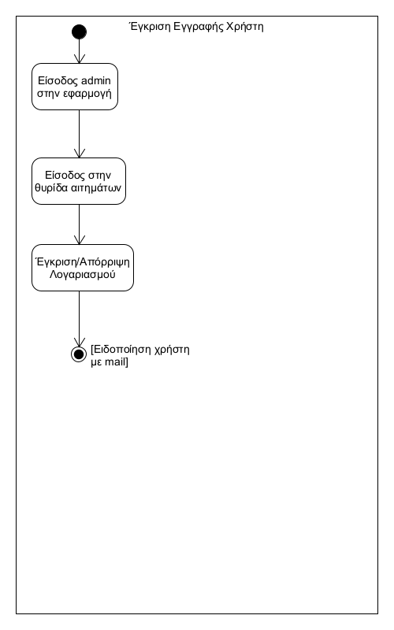

# ΠΧ3. Έγκριση Εγγραφής Χρήστη

**Πρωτεύων Actor**: Admin  
**Ενδιαφερόμενοι**  
**Admin**: Να εισέλθει στην εφαρμογή, να ελέγξει τα αιτήματα δημιουργίας λογαριασμού και να τα εγκρίνει/απορρίψει.  
**Χρήστης**: Να έχει κάνει αίτηση για δημιουργία λογαριασμού (sign up).  
**Προϋποθέσεις**: Κάποιος χρήστης έχει κάνει αίτηση για δημιουργία λογαριασμού (sign up).  

## Βασική Ροή

1.	Ο admin εισέρχεται στην εφαρμογή.
2.	Ο admin εισέρχεται στην θυρίδα με τα διαθέσιμα αιτήματα δημιουργίας λογαριασμών (sign up).
3.	Ο admin επιλέγει το κουμπί "Έγκριση" ή το κουμπί "Απόρριψη" για το εκάστοτε αίτημα.
4.	Ο χρήστης ειδοποιείται μέσω mail οτι ο λογαριασμός του δημιουργήθηκε ή απορρίφθηκε.  

## Εναλλακτικές Ροές

