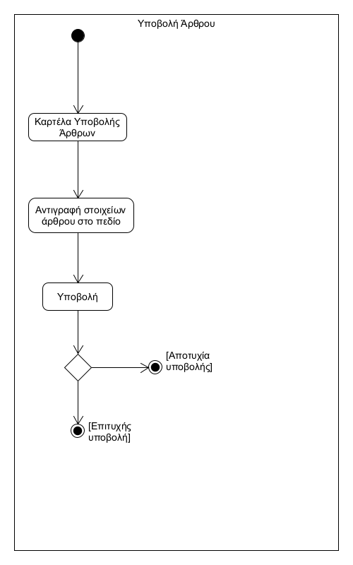

# ΠΧ5. Υποβολή Άρθρων - Πηγών

**Πρωτεύων Actor**: Εγγεγραμμένος Χρήστης  
**Ενδιαφερόμενοι**  
**Εγγεγραμμένος Χρήστης**: Να υποβάλει τα στοιχεία (πχ url) του άρθρου.  
**Προϋποθέσεις**: Ο χρήστης να έχει εισέλθει στον λογαριασμό του.  

## Βασική Ροή

1.	Ο χρήστης εισέρχεται στην καρτέλα υποβολής άρθρων.
2.	Ο χρήστης αντιγράφει τα στοιχεία (πχ url) του άρθρου στο πεδίο.
3.	Ο χρήστης πατάει υποβολή.
4.	Η εφαρμογή ενημερώνει τον χρήστη ότι η υποβολή έγινε επιτυχώς.

## Εναλλακτικές Ροές

4α. Ύπαρξη σφάλματος κατά την υποβολή.  
  1. Η εφαρμογή ενημερώνει τον χρήστη ότι η υποβολή έγινε ανεπιτυχώς.

